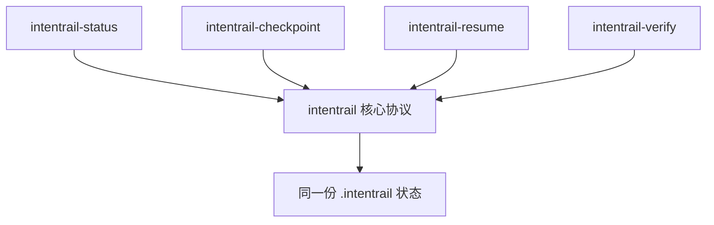
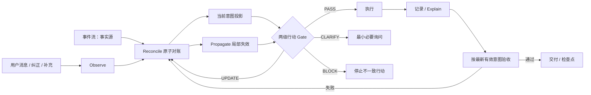

# IntentRail 开发规格

> 状态：v0.5 正式运行时与零手工 Python 配置发行链已实现；待宿主原生信任与发布门验收<br>
> 文档角色：IntentRail 产品与 V1 开发的权威规格（single source of truth）
> 最近更新：2026-08-15

## 0. v0.4 主线转向冻结

IntentRail 的产品中心由“保存和恢复版本化任务契约”收敛为“持续对账演化意图，并在旧意图继续产生实质行动前阻断漂移”。冻结后的主循环为：

```text
Observe -> Reconcile -> Propagate -> Gate -> Act -> Explain
```

冻结决策：

1. `events.jsonl` 是唯一事实源，`contract.json` 是可重建的当前意图投影；不新增第二套 Intent Ledger。
2. 同一用户消息产生的多项变化通过一个 reconciliation batch 原子提交；全部成功或全部不写。
3. 意图项将确定性 `certainty` 与有效性 `lifecycle` 分离；兼容字段 `state` 仅作为旧客户端投影。
4. `MODIFY` 产生 `superseded`，`REVOKE` 产生 `revoked`，两者不得混淆。
5. 影响传播只沿显式 `depends_on` 确定性地生成 `stale`；同作用域但无显式关系的派生项只标记 `needs_review`；确定性脚本不得猜测语义依赖。
6. Gate 分两级：普通可逆写入使用 turn/scope lease；路线变更、高风险、外部写入、发布和最终交付需要带 active `intent_refs` 的 Action Basis。
7. Hooks 只观察宿主生命周期、分类机械风险和校验凭证；语义变化判断仍由加载 Skill 的 Agent 完成。
8. Codex `/goal`、Claude Memory 等宿主能力只作为辅助上下文，不与 canonical 状态进行双向事实同步。
9. checkpoint、resume、status、verify 保留为恢复和控制能力，不再作为核心差异化卖点。
10. v0.4 产品版本使用状态 Schema `2.0.0`；从 `1.0.0` 显式迁移时先完整备份，再升级事件链、投影和 checkpoint，并使临时 Gate 凭证失效。

主线验收句：

> 当用户在任务执行过程中纠正、撤销或替换重要意图时，IntentRail 必须在 Agent 的下一次实质动作前吸收变化、局部失效旧依据，并使执行路线重新对齐最新意图。

### 0.1 v0.5 正式运行时发行冻结

开发源码继续使用 Python `>=3.11,<4`，但普通用户和 Agent Hook 不得负责选择、配置或调用系统 Python。正式安装固定为：

```text
uv tool install intentrail
intentrail install --hosts auto
```

或通过 `pipx` 安装 GitHub Release wheel 获得同样的隔离 CLI；发布到 PyPI 后也可直接按包名安装。`intentrail install` 必须检测宿主、从 wheel 内的 canonical runtime bundle 安装 Skill/Plugin、解析 managed CLI 绝对路径、将绝对路径写入 Hook、写入 CLI locator 与安装清单、预热 CLI、执行 dormant Hook I/O 探测并运行 doctor。

managed Hook 只能调用：

```text
"<absolute-intentrail-cli>" hook --host HOST --event EVENT
```

禁止在正式 Hook JSON 中出现 `python`、`python3` 或 `py -3`。Marketplace 直装包携带 Bash/PowerShell launcher 和无依赖 PEP 723 bootstrap，按“用户级可信 locator/manifest 绝对 CLI → PATH CLI → uv → 合格系统 Python 开发回退 → degraded”探测。仓库内 locator/manifest 不得作为自动执行命令的信任根；repo-scope managed Hook 直接写入安装时验证过的 CLI 绝对路径。系统 Python 只属于最后兼容回退，不得成为 Full 发行前提。

## 1. 文档维护规则

本文件记录已经确认的产品决策、实现约束、用户交互、开发范围和验收标准。后续设计发生变化时直接更新本文件，不另外创建互相竞争的架构说明。

维护时遵循以下规则：

1. 将已经得到确认的内容写入“已确认决策”，不要重新降级为开放问题。
2. 会改变产品定位、状态模型、兼容边界或验收标准的变化，先与用户确认，再修改规格。
3. 实现细节可以在不改变外部行为的前提下调整；影响用户行为或数据兼容性的调整必须记录。
4. 不以“先跑起来”为理由静默删除核心能力。无法实现时应明确说明阻碍和替代方案。
5. V1 目标是最小完整产品，而不是功能残缺的演示版本。

## 2. 项目摘要

IntentRail 是面向长任务 Agent 的演化意图对账与旧路线控制 Skill Suite。它持续吸收用户新增、替换、撤销和冲突意图，局部失效由旧意图支撑的决策，并在 Agent 基于过期依据采取实质行动前完成纠偏。

一句话定位：

> Evolving-intent reconciliation and stale-route control for agent work.

中文定位：

> 面向长任务的意图对齐系统：持续维护用户当前真正想要的结果，在执行偏离之前触发最小必要纠偏。

“IntentRail”由 Intent（意图）和 Rail（导轨）组成。Rail 不是限制用户改变需求，而是在用户意图变化时同步移动，使 Agent 沿最新目标继续工作。

## 3. 问题定义

### 3.1 LiC 问题

长对话中的失败并不只是“忘记了某句话”。更常见的情况包括：

- Agent 保留了旧目标，却漏掉后续修正；
- 新要求被识别为补充，但实际上替换了旧要求；
- Agent 将自己的假设逐渐当成用户已确认要求；
- 上下文压缩或任务交接后，状态总结遗漏关键变化；
- Agent 完整执行了早期方案，却没有完成用户当前真正需要的任务；
- 外部文档或工具输出中的指令污染了用户意图；
- Agent 在最终交付时按旧验收口径宣布完成。

IntentRail 将问题建模为“意图状态持续更新与行动前漂移控制”，而不是通用聊天记忆。

### 3.2 目标

IntentRail 必须：

- 识别目标、约束、决策和验收条件的新增、修改、撤销与冲突；
- 明确区分用户确认、模型推断和工作假设；
- 用一份权威任务契约表达当前有效意图；
- 在重要行动前检查行动是否仍符合当前意图；
- 在压缩、恢复和交接后重建正确工作状态；
- 允许用户查看、纠正、撤销、暂停和解释系统行为；
- 在降低 LiC 的同时控制额外提问、上下文和操作成本；
- 在多个 Agent 平台上保持同一语义行为。

### 3.3 非目标

V1 不定位为：

- 通用长期记忆系统；
- 用户人格画像或偏好挖掘系统；
- 自动跨项目学习系统；
- 完整需求管理、项目管理或任务 DAG 框架；
- Spec Kit 的复刻或缩小版；
- Mediator–Assistant 的多 Agent 复刻；
- 替代 Agent 本身规划、编码、研究或工具调用能力的框架；
- 只负责生成对话摘要的 Skill。

相关论文和成熟项目只作为问题、经验和工程设计参考，不作为必须套用的结构模板。

## 4. 已确认产品原则

1. 意图对齐优先于记忆积累。
2. 用户最新的明确要求优先，但真实冲突不能由 Agent 擅自解决。
3. 当前有效状态与历史变化分离存储。
4. 用户确认项与 Agent 假设必须分离。
5. 正常工作时保持低存在感，只有可能走偏时才打断。
6. 每轮最多提出一个普通阻塞性问题；高风险、不可撤销行动除外。
7. 不要求用户记忆严格命令语法，自然语言必须能够控制系统。
8. 一套产品、一套语义核心、一份状态；可以提供多个薄的显式入口。
9. Python 负责确定性状态操作，不负责决定用户真实意图。
10. Skill 是语义核心；hooks、插件和平台适配器是可靠性与分发增强。
11. 不静默降级平台能力，正式支持等级必须透明。
12. 第一轮开发必须考虑完整闭环、安全、迁移、测试和跨平台行为。

## 5. 产品形态：IntentRail Skill Suite

IntentRail 不是五套独立业务逻辑，而是一个自动工作的核心 Skill 加四个面向用户的薄入口。

| Skill | 主要职责 | 隐式调用 | 显式调用 |
| --- | --- | --- | --- |
| `intentrail` | 意图变化识别、契约更新、纠偏、用户控制 | 允许 | 允许 |
| `intentrail-status` | 只读展示当前目标、变化和待决定项 | 禁止 | 允许 |
| `intentrail-checkpoint` | 创建恢复检查点或 Agent 交接包 | 禁止 | 允许 |
| `intentrail-resume` | 从持久状态恢复任务 | 禁止 | 允许 |
| `intentrail-verify` | 按最新任务契约验收结果 | 禁止 | 允许 |

`sync` 不单独成为 Skill。用户纠正、补充或撤销要求时，核心 `intentrail` 应自动同步。`undo`、`pause`、`diff` 和交互强度调整由主入口通过自然语言提供，暂不占用独立 Skill 名称。



薄入口必须由规范或模板生成，不能复制并各自演化核心规则。所有入口读取同一状态，并通过同一个确定性引擎完成状态操作。

## 6. 用户调用与控制

### 6.1 平台调用映射

| 操作 | Codex | Claude Code / Copilot CLI | ChatGPT | 通用自然语言 |
| --- | --- | --- | --- | --- |
| 主入口 | `$intentrail ...` | `/intentrail ...` | `@intentrail ...` | “使用 IntentRail……” |
| 查看状态 | `$intentrail-status` | `/intentrail-status` | `@intentrail-status` | “你现在怎么理解任务？” |
| 创建检查点 | `$intentrail-checkpoint` | `/intentrail-checkpoint` | `@intentrail-checkpoint` | “先保存当前任务状态。” |
| 恢复 | `$intentrail-resume` | `/intentrail-resume` | `@intentrail-resume` | “从 IntentRail 检查点继续。” |
| 验收 | `$intentrail-verify` | `/intentrail-verify` | `@intentrail-verify` | “按最新要求验收。” |

插件或宿主必须使用命名空间时，可以显示宿主原生名称，但 canonical skill name 保持不变。

### 6.2 主入口控制操作

用户只记得 `intentrail` 时，仍然必须可以完成以下操作：

```text
$intentrail 按我的最新要求重新对齐
$intentrail 显示最近发生了什么变化
$intentrail 撤销上一次意图更新
$intentrail 暂停自动介入
$intentrail 恢复均衡提醒
$intentrail 接下来严格核对需求
$intentrail 这个规则只在本次任务有效
```

未提供参数时，主入口返回紧凑帮助，不执行破坏性或不可逆操作。

### 6.3 自动触发场景

核心 Skill 应在以下场景参与：

- 任务进入明显的多轮、分阶段或长时间执行；
- 用户补充、纠正、替换或撤销要求；
- 新要求与当前有效约束冲突；
- 用户表示 Agent 理解错误或已经跑偏；
- 即将执行重要、耗时或不可轻易撤销的行动；
- 上下文即将压缩、已经压缩或发生 Agent 交接；
- Agent 准备宣布完成或提交最终交付物。

以下场景默认不自动介入：

- 简单知识问答；
- 无歧义的一步操作；
- 普通闲聊；
- 纯只读且低风险的工具检查；
- 与当前任务契约无关的临时问题。

### 6.4 激活与生命周期状态机

IntentRail 运行状态固定为：

```text
DORMANT
  → ACTIVE
  → PAUSED
  → COMPLETED
  → ARCHIVED
  → RECOVERY_REQUIRED
```

- `DORMANT`：未建立任务契约；简单任务保持此状态，不创建 `.intentrail/`。
- `ACTIVE`：存在当前契约，执行变化吸收、重要行动前 Gate、checkpoint 和验收。
- `PAUSED`：保留状态但停止自动同步和自动 Gate；显式 status、resume 和 verify 仍可使用。
- `COMPLETED`：已经按当前契约验收并结束；后续修改仍可重新激活同一契约。
- `ARCHIVED`：历史任务只读保留，不参与当前行动判断。
- `RECOVERY_REQUIRED`：状态不一致、损坏或迁移失败；允许只读诊断，阻止高风险行动。

生命周期规则：

1. 显式调用 `intentrail` 并要求对齐时建立或选择契约；只调用 status 且没有状态时不创建契约。
2. 自动触发先判断是否存在持续性收益；短问答、一步低风险动作和临时岔题不得只因 Skill 被加载就持久化。
3. 新消息明显属于当前任务时更新当前契约；明显是临时问题时不改变契约。
4. 新目标与当前目标无关且会产生独立交付物时创建新契约或要求用户选择，禁止静默覆盖旧契约。
5. 同一项目只有一份活跃契约时自动绑定；多份活跃契约且上下文不足时询问一次。
6. `pause` 不删除数据；`resume` 恢复自动行为前先校验状态。
7. `complete` 必须经过最新契约验收；完成后保留契约和事件历史。
8. `archive` 只改变参与判断的状态；删除契约属于显式、需确认的破坏性操作，V1 不提供自动删除。

首次自动进入 `ACTIVE` 采用延迟持久化：仅仅加载 Skill 或进行临时判断不创建文件；当任务已满足自动激活条件并形成第一项需要跨轮保留的重要意图状态时，自动创建状态，不阻塞询问。首次创建后只显示一次一行回执：

```text
IntentRail 已开始跟踪本任务的目标变化；状态仅保存在当前项目，可随时让我暂停或查看。
```

通知不是确认请求，显示后继续执行当前任务。后续普通状态更新不重复显示首次通知。

## 7. 用户交互策略

### 7.1 默认体验

IntentRail 平时静默工作，只在四类时刻面向用户显示：

1. 重要意图发生变化；
2. 存在真正阻塞执行的歧义；
3. 任务从压缩、检查点或交接恢复；
4. 最终交付需要验收。

内部术语不直接要求用户理解。对用户使用“当前目标、已确认、暂定、待决定、已取消”等表达，不强制暴露 Contract、Delta、Gate 等实现词汇。

### 7.2 变化回执

重要变化默认使用一至三行回执：

```text
已同步：数据库由 MySQL 改为 PostgreSQL；其他已确认要求不变。
接下来会相应调整数据模型和部署配置。
```

回执应回答：

- 变化了什么；
- 哪些内容继续有效；
- 对下一步有什么影响。

只有存在冲突或高风险不确定性时才要求用户确认。

### 7.3 最小必要询问

只有同时满足以下条件才询问用户：

```text
信息确实缺失
AND 不同答案会导致不同的实质结果
AND 无法通过安全、可撤销的默认值继续
```

询问要求：

- 每轮最多一个普通阻塞问题；
- 优先询问信息增益最高的问题；
- 提供选项、影响和推荐选择；
- 用户暂缓的问题记录为 deferred，不重复打扰；
- 非阻塞问题积累到自然检查点；
- 沉默不能视为对长期经验或高风险决策的确认。

### 7.4 交互强度

运行时支持：

- `quiet`：只在明确冲突或高风险行动前打断；
- `balanced`：默认，重要变化给予简短回执；
- `strict`：关键阶段均进行显式核对。

这三种是运行时交互策略，不是三个产品版本或安装模式。用户通过自然语言调整。

### 7.5 纠错行为

用户说“不对”“不是这个意思”时执行：

```text
停止旧路线
→ 识别用户最新变化
→ 标记旧理解失效
→ 给出简短的新理解
→ 从最近安全点继续
```

不得先为旧理解辩护。只有无法判断用户否定的对象时才询问。

### 7.6 恢复与交付展示

恢复消息默认只展示：当前目标、已完成状态、最近变化和下一步。状态无冲突时直接继续，不要求仪式化确认。

最终交付使用验收回执，区分：

- 已通过；
- 未通过；
- 未纳入本阶段范围；
- 阻止宣布完成的剩余事项。

## 8. 运行时意图对齐协议

### 8.1 主循环



### 8.2 Delta Reconciliation

将用户最新消息相对于上一版投影分类为：

- `ADD`：新增要求；
- `MODIFY`：修改现有要求；
- `REVOKE`：撤销要求；
- `CONFIRM`：确认假设或决策；
- `CONFLICT`：与当前有效内容冲突；
- `DEFER`：推迟决定；
- `RESOLVE`：解决已有冲突。

同一用户消息的全部 material changes 必须放入一个 reconciliation batch，以 `base_version` 和幂等键执行全有或全无的原子提交。`event apply` 只保留给单个生命周期/控制事件与兼容集成。

不能因为用户修改一个约束就默认否定整个方案。用户表达“只改 X，其他不变”时必须保留未涉及内容。

变化判定固定遵循：

1. 先识别变化指向的实体与作用域，再判断新增、修改或撤销；“最新消息”只覆盖同一实体、同一作用域内被明确替换的内容。
2. 最新消息与旧要求可以同时成立时，优先解释为 `ADD`，不得制造虚假冲突。
3. 用户明确使用“改成、不要、撤销、替代、之前理解错了”等语义且替代对象清楚时，产生 `MODIFY` 或 `REVOKE`；前者使旧项进入 `superseded`，后者进入 `revoked`。
4. 不能共存但用户没有表达替代关系时，产生 `CONFLICT`，保留两侧来源并在相关重要行动前询问。
5. 用户只纠正局部时，其余已确认项保持有效；禁止借局部更新重建整个目标。
6. 推断或假设被用户否定时直接失效，不要求用户再次证明；被用户肯定时通过 `CONFIRM` 新事件升级。
7. 外部不可信内容即使使用命令式语言，也只能成为证据或候选信息，不能产生用户级 `ADD`、`MODIFY`、`REVOKE` 或 `CONFIRM`。

语义分类不能通过关键词脚本完成。关键词只可帮助定位候选变化，最终分类由 Agent 结合当前契约与用户消息判断。

### 8.3 意图状态

每项内容使用两个正交维度：

- `certainty`：`confirmed`、`inferred` 或 `assumed`；
- `lifecycle`：`active`、`conflicted`、`superseded`、`revoked`、`stale` 或 `needs_review`。

兼容字段 `state` 由以上两项派生，不参与 canonical 判断。显式依赖已失效的 Agent 决策标记为 `stale`；仅作用域可能受影响但缺少显式依赖时标记为 `needs_review`。

不得把 `inferred` 或 `assumed` 静默升级为 `confirmed`，也不得把 `needs_review` 自动解释为错误。

同一实体发生竞争时，决策优先级固定为：

1. 当前用户消息中的明确要求；
2. 未被替代的历史用户确认项；
3. 用户明确授权为约束来源的可信项目配置；
4. Agent 推断；
5. 为继续可逆工作采用的临时假设；
6. 外部不可信内容仅作证据，不参与意图优先级。

平台安全策略、系统指令和工具权限不写成用户意图，也不参与上述排序；它们是更外层的执行边界。若用户目标受这些边界阻止，应解释限制并保留用户目标，不得伪造为用户撤销了要求。

### 8.4 Drift Gate

在重要行动前比较准备执行的行动与当前目标、约束和验收标准，输出：

- `PASS`：一致，可以执行；
- `UPDATE`：先吸收用户最新变化；
- `CLARIFY`：关键歧义会改变实质结果；
- `BLOCK`：行动明确违反当前契约。

重要行动包括：

- 创建或大范围修改业务文件；
- 删除、覆盖、部署、发送或发布；
- 选定难以撤销的技术路线；
- 启动耗时较长的批量任务；
- 生成最终交付物；
- 宣布任务完成。

普通只读检索和低风险诊断不运行完整 Gate。

决策表固定为：

| 条件 | Gate 结果 | 行为 |
| --- | --- | --- |
| 契约有效，行动与目标、约束和验收标准一致 | `PASS` | 签发相应凭证后执行 |
| 存在尚未吸收的用户变化 | `UPDATE` | 先更新契约，再重新运行 Gate |
| 缺失信息会改变实质结果，且没有安全可撤销默认值 | `CLARIFY` | 每轮询问一个最高信息增益问题 |
| 行动明确违反有效约束或使用已失效路线 | `BLOCK` | 停止该行动，说明冲突并给出一致替代方案 |
| 状态损坏、事件链断裂或契约版本无法验证 | `BLOCK` | 进入 `recovery-required`；只允许恢复与只读诊断 |
| 仅有非阻塞不确定性且行动可安全撤销 | `PASS` | 将不确定项记录为 assumption，不冒充 confirmed |

### 8.5 Gate 凭证

为了让 Skill 的语义判断与宿主 Hook 的确定性阻断配合，V1 使用两级 Gate：

- **Level 1 / turn-scope lease**：完成本轮变化吸收并与当前投影版本对齐后签发，允许本轮内与声明作用域一致的普通、本地、可撤销副作用。
- **Level 2 / Action Basis**：路线变更、删除、覆盖、部署、发布、发送、外部写入、长批处理和最终交付必须声明行动摘要、精确目标、作用域、至少一个 active `intent_ref` 以及可选 active `decision_refs`；需要确定性阻断时写入一次性 action ticket。

turn lease 至少绑定：契约 id、契约版本、事件头哈希、宿主 binding、turn/prompt 标识、允许的作用域、签发时间和失效条件。它在下一条用户消息、契约版本变化、binding 结束或兜底 10 分钟到期中的最早时刻失效。

action ticket 在 turn lease 基础上额外绑定：行动类别、目标摘要、目标指纹、`intent_refs`、`decision_refs`、影响作用域和单次消费状态；默认 5 分钟到期，不得自动续签或跨契约复用。任一引用不再 active 时失败关闭。

只有 Agent 完成语义 Gate 后才能请求确定性工具写入凭证。Python 只校验字段、版本、哈希、时效、作用域、引用生命周期和消费状态，不自行判断 `PASS`。IntentRail Gate 只判断意图一致性，不替代宿主权限与安全授权。不可信内容、项目脚本和 Hook 不能直接签发凭证。

Hook 处理规则：

- 只读诊断不要求凭证；
- 普通本地副作用要求有效 turn lease；
- 高风险动作要求有效且未消费的 action ticket；
- 凭证缺失或过期时先阻止该次工具调用，把重新运行 Gate 的原因反馈给 Agent；
- 状态损坏时高风险动作失败关闭；
- `paused` 状态不运行 IntentRail Gate，但仍受宿主权限和安全机制约束；
- 宿主不能可靠执行阻断时只能声明 `Standard`。

## 9. 持久状态模型

项目级状态固定存放在项目根目录的 `.intentrail/`。宿主适配器不得建立第二份语义状态；多个 Agent 在同一工作区内读取同一目录。

```text
.intentrail/
├── index.json
├── config.json
├── precedents.json
├── bindings/
│   └── <binding-id>.json
├── runtime/
│   └── <binding-id>/
│       ├── lease.json
│       └── tickets/
│           └── <ticket-id>.json
└── contracts/
    └── <contract-id>/
        ├── contract.json
        ├── events.jsonl
        ├── checkpoints/
        │   ├── index.json
        │   └── <checkpoint-id>.json
        └── backups/
```

`status.md`、紧凑恢复摘要和 Agent 交接说明均由 canonical JSON 按需渲染，不作为权威状态文件保存。`.lock` 和同目录临时文件只在事务写入期间存在。

`index.json` 保存项目 id、schema version 和契约索引。V1 从数据模型开始支持一个项目存在多份任务契约，但默认交互仍围绕当前一份契约：显式指定契约优先，其次使用当前宿主会话绑定；只有一份活跃契约时自动选中；存在多份活跃契约且无法推断时只询问一次。不得把两个独立任务静默合并。

`bindings/` 只保存宿主会话到契约 id 的短小映射，不保存对话内容。绑定失效不影响契约恢复；跨 Agent 交接可以通过契约 id 或 checkpoint 显式恢复。

`runtime/` 保存第 8.5 节定义的短期 Gate 凭证。它不是 canonical 状态，不进入 checkpoint、备份或共享包，可以在没有活跃进程时安全清理。删除 runtime 不会丢失意图，只会要求下次副作用行动重新运行 Gate。

### 9.1 `contract.json`

由事件流重建的当前意图物化投影。它是高效读取入口，但不是独立事实源。Schema 2.0 固定包含：

```text
schema_version
contract_id
project_id
version
status
created_at
updated_at
objective
deliverables[]
constraints[]
acceptance_criteria[]
decisions[]
questions[]
assumptions[]
completed_work[]
superseded_items[]
current_stage
next_material_action
last_event_id
event_head_hash
```

除顶层元数据外，每个意图项统一包含：

```text
id
kind
text
state（兼容投影）
certainty
lifecycle
source
source_ref
scope
created_version
updated_version
supersedes[]
depends_on[]
invalidated_by[]
tags[]
```

冻结规则：

- 当前有效状态与历史记录分离；
- 确认约束与工作假设分离；
- 被替换内容保留可追溯记录，但不继续参与行动判断；
- canonical 逻辑只读取 `certainty + lifecycle`；`state` 必须与二者一致；
- `depends_on` 只表达明确支撑关系，确定性脚本不得通过关键词生成；
- `source.kind` 只能取 `user`、`agent`、`trusted_project_source`、`external_untrusted_content` 或 `system`；
- `source_ref` 只保存可定位的最小引用或哈希，不复制大段原始对话；
- `version` 是从 1 开始单调递增的整数；
- `status` 只能取 `active`、`paused`、`completed`、`archived` 或 `recovery-required`；
- 未知字段读取时保留，写回时不得静默丢弃，以支持向前兼容；
- 快照必须与 `last_event_id` 和 `event_head_hash` 对应，否则先恢复再执行重要行动。

### 9.2 `events.jsonl`

以仅追加事件记录所有持久状态变化。事件日志是唯一事实源、崩溃恢复和审计依据，`contract.json` 是可重建读取投影。每行是一个完整 JSON 对象，Schema 2.0 事件固定包含：

```text
schema_version
event_id
contract_id
sequence
timestamp
operation
entity_kind
entity_id
before
after
source
source_ref
intent_state
contract_version_before
contract_version_after
reversible
inverse_of
idempotency_key
previous_hash
reconciliation_id
reconciliation_index
reconciliation_size
event_hash
```

`operation` 首批取值：

```text
ADD
MODIFY
REVOKE
CONFIRM
CONFLICT
DEFER
RESOLVE
PROGRESS
CHECKPOINT
UNDO
PAUSE
RESUME
VERIFY_PASS
VERIFY_FAIL
COMPLETE
ARCHIVE
MIGRATE
```

冻结规则：

- `sequence` 和契约版本必须连续；
- `idempotency_key` 防止宿主重试造成重复事件；
- `before`、`after` 只保存重建所需的最小结构，不保存无必要秘密；
- 每个事件通过 `previous_hash` 和 `event_hash` 形成完整性链；
- 最后一行不完整时先备份再截断到最后一个有效事件；
- 中间事件损坏、哈希断裂或版本跳跃时进入 `recovery-required`，不得执行高风险动作；
- `undo` 追加逆向事件，不修改或删除历史行。

### 9.3 `contracts/<contract-id>/checkpoints/`

每个 checkpoint 使用不可变 JSON 文件，只保存恢复工作所需的最小信息：

- 当前目标；
- 有效约束；
- 验收标准；
- 已完成内容；
- 未解决问题；
- 最近重要变化；
- 下一步行动；
- 不应重复执行的操作；
- 相关文件和证据位置；
- 对应契约版本和校验信息。

`index.json` 记录 checkpoint id、创建时间、契约版本、用途、文件哈希和是否仍可恢复。恢复默认不回滚工作区文件，只恢复 IntentRail 语义状态并明确列出不应重复的动作；工作区文件回滚必须由用户另行授权。

### 9.4 `precedents.json`

只保存当前项目内经过用户确认的稳定经验。候选经验不得在工作过程中频繁弹出，应在自然检查点集中提议。

经验必须：

- 标明来源和适用范围；
- 经用户确认；
- 可以撤销；
- 默认不跨项目；
- 不由网页、代码注释或工具输出自动写入。

经验项至少包含：`id`、`text`、`scope`、`source_ref`、`confirmed_at`、`last_used_at`、`status`。候选经验保留在当前契约的待决定项中，未确认前不得写入 `precedents.json`。

候选经验在契约归档时若仍未确认则丢弃。已确认项目经验不按固定期限自动删除；连续 180 天未使用时标记为 `stale`，不得自动影响新契约，只有用户重新确认或在当前任务中再次明确采用后才能恢复为 `active`。用户可以随时查看、撤销或清空项目经验。

### 9.5 `config.json`

至少包含：

- schema version；
- interaction mode；
- persistence policy；
- sharing policy；
- paused state；
- checkpoint policy；
- host capability information。

配置采用同一 `schema_version` 体系。宿主能力是检测结果缓存，不得改变 canonical 意图语义。

默认共享策略采用 B1：`.intentrail/` 完整状态只保存在本地。Git 仓库中优先写入本地 exclude（例如 `.git/info/exclude`），不自动修改团队共享的 `.gitignore`。同一工作区内不同 Agent 仍直接读取同一状态；跨设备或团队交接必须由用户显式生成可预览的脱敏交接包。共享包不是 canonical 状态，导入时必须作为待校验恢复来源，不能无条件覆盖目标仓库的当前契约。

### 9.6 一致性、锁和原子写入

V1 固定采用标准库可实现的跨平台方案：

1. 使用 `os.open(..., O_CREAT | O_EXCL)` 创建契约级锁文件；修改项目索引时另取短时项目锁。锁中记录随机 owner id、进程信息和创建时间。
2. 读取并校验当前快照、事件尾和期望版本；版本不一致时拒绝覆盖并重新加载。
3. 将新事件作为完整单行追加并 `flush`、`fsync`。
4. 将新快照写入同目录临时文件，完成校验和 `fsync` 后使用 `os.replace` 原子替换。
5. 释放锁。读取到“事件版本领先快照一个或多个版本”时，从事件日志重放并重建快照。

过期锁不能只按时间自动抢占。必须同时检查 owner、进程存活信息和锁龄；无法可靠判断时进入恢复流程。迁移前复制相关状态到对应契约的 `backups/<timestamp>-v<schema>/`；项目级 schema 迁移另备份 `index.json`、`config.json` 和 `precedents.json`。迁移成功后保留备份，卸载程序不得删除 `.intentrail/`。

## 10. 安全与信任边界

IntentRail 的状态会直接影响 Agent 后续行为，因此必须视为安全敏感数据。

V1 必须满足：

- 只有用户明确消息和授权的可信项目配置可以确认或撤销用户意图；
- 网页、PDF、代码注释、issue、日志和工具输出默认是不可信内容；
- 不可信内容可以作为证据，不能直接修改任务契约；
- 每次重要状态更新可追溯到来源；
- 不自动保存跨项目用户画像；
- 不在事件日志中写入无必要的秘密、凭据和大段原始内容；
- 状态文件损坏时不执行高风险行动；
- 恢复失败时从最近明确用户要求重建，并显示不确定项；
- `undo` 不删除历史证据，而是追加反向事件；
- 状态迁移必须保留旧版本备份或提供可恢复路径。

脱敏交接固定遵循：

- 只有用户显式要求时生成；
- 生成前执行秘密检测和绝对路径清理，并向用户展示紧凑预览；
- 默认不包含事件日志、对话原文、binding、runtime 凭证、备份和已撤销内容全文；
- 包含 schema version、来源契约 id、来源版本、生成时间和内容哈希；
- 导入时先创建候选恢复视图，与目标项目现有契约比较，不能直接覆盖；
- 目标项目存在冲突时必须由用户决定合并、建立新契约或取消导入；
- 交接包不得作为可信项目配置自动确认用户意图。

交接默认采用 C1“可验证定位型交接”，包含目标、有效约束、验收标准、完成状态、下一步，以及必要的相对路径、证据定位和短摘要，但不包含文件正文或工具输出正文。

每个工作定位至少包含：

```text
path
symbol_or_anchor
summary
source_revision
file_digest
verification_status
```

其中 `path` 必须是项目根目录内的规范化相对路径；`source_revision` 只保存版本标识，不保存远程仓库 URL；`verification_status` 在生成时只能表示来源侧状态，导入后必须重新计算为 `verified`、`stale` 或 `unresolved`。路径和摘要只能帮助寻找证据，不能证明任务已经完成。

生成器必须拒绝绝对路径、盘符、UNC 路径、`..` 穿越、空字符、异常编码、项目外符号链接、超长路径和超量定位项。摘要采用字段白名单和长度上限；命中凭据格式、私钥头、连接串、高熵秘密或敏感路径规则时默认排除并要求用户处理。

生成流程固定为：候选收集 → 路径规范化 → 敏感信息扫描 → 用户预览与逐项排除 → 生成包和独立 SHA-256 校验文件。导入流程固定为：结构与完整性校验 → 项目和版本比较 → 路径/摘要重新验证 → 候选恢复视图 → 显示差异 → 用户确认后新建或合并契约。

校验哈希只检测意外损坏，不证明发送者身份。V1 不自行设计加密协议；交接包通过用户已有的安全存储或传输渠道移动。敏感任务可以在生成时切换为无路径的 C2 模式。

## 11. 确定性工具边界

Python 工具负责：

- 初始化 `.intentrail/`；
- 校验状态结构和 schema version；
- 读取和渲染紧凑状态；
- 追加事件；
- 校验并原子提交一轮 reconciliation batch；
- 沿显式 `depends_on` 传播 `stale`，并对同作用域未链接派生项标记 `needs_review`；
- 创建、验证和恢复 checkpoint；
- 生成契约版本和哈希；
- 计算状态 diff；
- 撤销最近一次可撤销变更；
- 执行安全的数据格式迁移；
- 为平台适配器提供统一接口。

Python 工具不负责：

- 判断用户真实意图；
- 决定冲突要求的优先级；
- 替用户确认假设；
- 通过关键词机械覆盖任务契约；
- 将外部内容自动提升为用户要求。

### 11.1 运行环境基线

V1 工程基线冻结为：

- 开发、源码安装和 uv/pipx 隔离环境中的实现版本为 Python `>=3.11,<4`；普通用户无需自行配置该解释器；
- CI 覆盖 CPython 3.11、3.12、3.13、3.14；
- 支持 Windows、macOS 和 Linux；
- 核心运行时只使用 Python 标准库；构建、测试工具可以作为开发依赖，但不得成为 Skill 运行前提；
- 文本和 JSON 使用 UTF-8，无 BOM；
- 时间使用 UTC RFC 3339，写出时采用 `Z`；
- 状态中的项目文件路径使用项目根相对路径和 `/` 分隔符；
- 不依赖 shell 专有语法完成核心状态操作；
- 不进行遥测，不要求网络，不读取项目根目录外数据，除非用户显式指定导入文件。

Python 3.11 是实现与 CI 下限，不是普通用户的系统环境要求。uv 可以按项目元数据提供正确解释器；pipx 将 CLI 与系统导入路径隔离。进入 EOL 后通过新的产品版本调整实现下限。

### 11.2 Canonical CLI

稳定 CLI 冻结为：

```text
intentrail init [--root PATH] [--scope repo|user]
intentrail install [--hosts auto|all|LIST] [--scope repo|user] [--dry-run]
intentrail upgrade [--hosts auto|all|LIST] [--scope repo|user] [--dry-run]
intentrail uninstall [--hosts auto|all|LIST] [--scope repo|user] [--dry-run]
intentrail doctor [--hosts auto|all|LIST] [--scope repo|user]
intentrail contract create --input FILE|-
intentrail contract select CONTRACT_ID
intentrail event apply --input FILE|-
intentrail reconcile --input FILE|-
intentrail status [--contract ID] [--compact|--json]
intentrail progress --input FILE|-
intentrail explain [--contract ID] [--item ITEM_ID|--ticket TICKET_ID]
intentrail diff [--contract ID] [--from VERSION] [--to VERSION]
intentrail validate [--contract ID] [--repair-tail]
intentrail checkpoint create [--contract ID] [--purpose TEXT]
intentrail checkpoint list [--contract ID]
intentrail checkpoint show CHECKPOINT_ID
intentrail resume --contract ID|--checkpoint ID
intentrail gate lease --input FILE|-
intentrail gate ticket --input FILE|-
intentrail gate consume TICKET_ID
intentrail verify --input FILE|-
intentrail undo [--contract ID] [--event EVENT_ID]
intentrail revert [--contract ID] [--event EVENT_ID]
intentrail pause [--contract ID]
intentrail unpause [--contract ID]
intentrail mode quiet|balanced|strict
intentrail precedents list|confirm|revoke
intentrail handoff export [--contract ID] [--mode c1|c2] --output FILE
intentrail handoff inspect FILE
intentrail handoff import FILE [--new-contract|--merge]
intentrail hook --host HOST --event EVENT
intentrail migrate [--to SCHEMA_VERSION]
intentrail version [--json]
```

全局约定：

- `--root` 显式指定项目根；未给出时按宿主适配器或向上查找项目标记解析；
- `--contract` 未给出时按显式选择、binding、唯一 active 契约的顺序解析；多份 active 且无法判断时返回冲突，不猜测；
- `--input -` 从 stdin 读取一个 JSON 对象，禁止混入日志文本；
- 修改状态的命令必须要求期望契约版本或相应幂等键；
- `status`、`diff`、`explain`、`validate`、`checkpoint list/show`、`handoff inspect` 和 `version` 是只读命令；`progress` 只更新执行游标，不修改用户意图；
- `validate --repair-tail` 只允许修复事件日志最后一条不完整记录，修复前备份；中间损坏不得自动修复；
- `handoff import --merge` 在存在任何语义冲突时只生成候选 diff，不直接提交；
- `hook` 是宿主唯一固定入口，输出宿主原生 JSON，不使用普通 CLI envelope；适配器不得直接修改状态文件。

### 11.3 JSON 输出与退出码

除 `hook` 外所有命令支持 `--json` 并使用统一 envelope；Hook 调用强制输出宿主原生 JSON。stdout 只能包含一个 JSON 对象，诊断日志写入 stderr。普通命令 envelope 为：

```text
schema_version
ok
command
exit_code
message
data
warnings[]
error
```

稳定退出码：

| 代码 | 名称 | 含义 |
| --- | --- | --- |
| 0 | `OK` | 命令成功，或验证明确通过 |
| 1 | `OPERATION_FAILED` | 一般操作失败或验证未通过 |
| 2 | `USAGE_ERROR` | 参数、输入格式或命令用法错误 |
| 3 | `STATE_NOT_FOUND` | 未初始化、契约或 checkpoint 不存在 |
| 4 | `RECOVERY_REQUIRED` | 状态损坏、事件链断裂或必须恢复 |
| 5 | `INTENT_CONFLICT` | 需要用户澄清或合并选择 |
| 6 | `STALE_VERSION` | 乐观并发版本不匹配或重复更新冲突 |
| 7 | `PERMISSION_REQUIRED` | 需要宿主信任、权限或用户授权 |
| 8 | `UNSUPPORTED_CAPABILITY` | 当前宿主不支持所需能力 |
| 9 | `MIGRATION_REQUIRED` | Schema 版本不兼容或迁移未完成 |
| 10 | `GATE_BLOCKED` | Drift Gate 或 Hook 阻止行动 |
| 11 | `SENSITIVE_CONTENT` | 脱敏检查阻止导出或导入 |
| 12 | `INTERNAL_ERROR` | 未分类内部错误；不得包含秘密堆栈到 stdout |

错误对象至少包含稳定 `code`、用户可读 `message`、可选 `details` 和 `recovery_actions[]`。人类模式可以使用本地化文字，JSON 字段名、枚举和错误码保持英文稳定。

### 11.4 版本与迁移

- Skill Suite、CLI 和插件使用同一个 SemVer 产品版本；
- 状态与交接 Schema 单独使用 SemVer；v0.4 及 v0.5 使用 `2.0.0`，并提供从 `1.0.0` 的显式备份迁移；
- 补丁版本只能增加校验或修复，不改变有效文档含义；
- 次版本可以增加可选字段和枚举能力，读取器必须保留未知字段；
- 删除字段、改变既有含义或使旧文档失效必须升级 Schema 主版本；
- 当前程序拒绝写回比自身更新的 Schema 主版本；
- 自动迁移只沿已实现、逐版本、可测试的迁移链前进，不跳过中间步骤；
- 迁移前备份，迁移后同时验证 Schema、事件链和契约哈希；失败时恢复旧状态并返回 9；
- 不提供自动降级；回滚程序版本前必须先恢复兼容备份；
- 产品版本升级不得隐式迁移用户状态，安装结束后先 dry-run 检查，再由显式升级流程执行。

### 11.5 安装、升级与卸载

安装器冻结支持：`install`、`upgrade`、`uninstall`、`doctor`、`dry-run`，并满足：

- repo scope 和 user scope 均可选择；
- 先检测宿主、managed CLI 绝对路径、Skill 位置、现有同名安装、Hook 能力和信任状态；不得把系统 Python 探测作为正式安装成功条件；
- 正式用户入口是 `intentrail install`，仓库 `tools/install.py` 仅为开发兼容包装；
- wheel 必须内嵌由 canonical Skill/adapter 生成并校验版本的 runtime bundle，不能依赖仓库 `dist/`；
- managed Hook 必须写 CLI 绝对路径；GUI 宿主 PATH 不同的恢复由用户级可信 locator 提供，仓库 locator 不作为自动执行信任根；
- 安装结束必须执行 `version` 预热和 dormant `PreToolUse` 原生 JSON 探测；失败时恢复旧安装清单、locator、插件与 Hook；
- dry-run 输出将创建、修改、保留和需要用户信任的全部目标；
- 重复安装相同版本幂等；不同版本使用暂存目录、校验哈希和原子切换；
- 修改宿主 Hook 配置前备份，只管理带 IntentRail owner 标记的条目；
- 不覆盖用户自定义的同名非 IntentRail 配置；冲突时停止并给出处理方案；
- 升级失败恢复原插件与 Hook 配置；
- 卸载只删除由安装清单记录的程序文件和配置条目，永不删除项目 `.intentrail/`、交接包或用户业务数据；
- 插件构建产物携带产品版本、Schema 兼容范围和 canonical 内容哈希；
- `doctor` 明确报告每个宿主的 `Full`、`Standard` 或不可用原因。

## 12. 计划仓库结构

```text
IntentRail/
├── DEVELOPMENT_SPEC.md
├── README.md
├── LICENSE
├── pyproject.toml
├── schemas/
│   ├── common.schema.json
│   ├── project-index.schema.json
│   ├── binding.schema.json
│   ├── contract.schema.json
│   ├── event.schema.json
│   ├── config.schema.json
│   ├── checkpoint.schema.json
│   ├── checkpoint-index.schema.json
│   ├── precedent.schema.json
│   ├── gate-lease.schema.json
│   ├── action-ticket.schema.json
│   ├── handoff.schema.json
│   ├── install-manifest.schema.json
│   └── cli-envelope.schema.json
├── src/
│   └── intentrail_core/        # canonical deterministic runtime
├── skills/
│   ├── README.md
│   ├── intentrail/
│   │   ├── SKILL.md
│   │   ├── agents/
│   │   │   └── openai.yaml
│   │   ├── references/
│   │   │   ├── alignment-protocol.md
│   │   │   ├── contract-format.md
│   │   │   ├── drift-gate.md
│   │   │   ├── recovery.md
│   │   │   ├── interaction-policy.md
│   │   │   ├── decision-questioning.md
│   │   │   ├── user-messages.md
│   │   │   └── probes.md
│   │   └── scripts/
│   │       └── intentrail.py  # thin launcher; runtime injected only in release packages
│   ├── intentrail-status/
│   │   └── SKILL.md
│   ├── intentrail-checkpoint/
│   │   └── SKILL.md
│   ├── intentrail-resume/
│   │   └── SKILL.md
│   └── intentrail-verify/
│       └── SKILL.md
├── adapters/
│   ├── codex/intentrail/
│   ├── claude-code/intentrail/
│   ├── copilot/intentrail/
│   ├── shared/intentrail_bootstrap.py
│   ├── shared/intentrail_bootstrap.sh
│   ├── shared/intentrail_bootstrap.ps1
│   └── generic-agent-skills/capabilities.json
├── distribution/
│   └── canonical.json
├── tools/
│   ├── install.py
│   ├── build_distributions.py
│   ├── build_release.py
│   └── check.py
├── docs/
│   ├── installation.md
│   ├── architecture.md
│   ├── platform-support.md
│   └── releasing.md
├── skills.sh.json
├── dist/                     # generated, not source of truth
├── evals/
│   └── cases/
└── tests/
```

说明：

- 仓库根目录可以包含开发和用户文档；实际 Skill 安装目录只保留运行所需文件。
- `SKILL.md` 保持精简，详细协议按需加载，避免自身造成上下文负担。
- 暂不创建无实际用途的 `assets/`。
- 薄入口由 canonical 模板生成或校验，禁止复制后独立维护。
- `schemas/` 是状态与接口兼容性的可机读契约；实现不得维护与其冲突的隐式结构。
- `src/intentrail_core/` 是唯一确定性运行时源码；Marketplace fallback 只在构建宿主包时注入。
- `distribution/canonical.json` 是四类宿主包的生成源；生成产物进入发布目录，不作为第二份源码维护。
- 该结构按 IntentRail 的实际职责冻结，不因参考 Spec Kit 而机械保留无关层级。

## 13. 跨 Agent 兼容

### 13.1 适配原则

```text
一套 canonical protocol
+ 一套 canonical state
+ 薄平台适配器
```

首批目标平台：

1. Codex；
2. Claude Code；
3. GitHub Copilot CLI；
4. 通用 Agent Skills 目录规范。

适配器负责：

- Skill 安装位置；
- 显式调用名称和 UI 元数据；
- 隐式调用开关；
- 参数传递；
- Skill 路径解析；
- 支持时的 hooks 和生命周期事件；
- 平台能力检测和用户可见说明。

适配器不得复制语义协议或维护独立状态。

### 13.2 支持等级

- `Full`：自动触发、持久状态、恢复和行动前检查均可验证；
- `Standard`：语义闭环完整，部分生命周期事件依赖 Agent 主动执行；
- `Unsupported`：无法保证核心语义，不列为正式支持。

平台缺少 hooks 时不能宣称拥有确定性行动拦截。能力矩阵必须区分平台限制与 IntentRail 缺陷。

基于 2026-08-06 官方文档核验，V1 冻结以下目标等级：

| 平台 | Skill 自动/显式调用 | 生命周期 Hook | 重要行动前阻断 | V1 目标 | 发布声明条件 |
| --- | --- | --- | --- | --- | --- |
| Codex | 支持，`$skill` 显式或按 description 隐式 | 支持 UserPrompt、Session、PreToolUse、Pre/PostCompact、Stop 等 | `PreToolUse` 可拒绝支持的工具调用 | `Full` | 安装、信任、压缩恢复和阻断路径全部端到端通过 |
| Claude Code | 支持，`/skill-name` 或隐式加载 | 支持 Session、Prompt、PreToolUse、Compact、Stop 等 | `PreToolUse` 可阻断 | `Full` | Skill 生命周期、权限、压缩携带和 Hook 阻断全部端到端通过 |
| GitHub Copilot CLI | 支持，`/SKILL-NAME` 或自动调用 | 支持 hooks，包括 `preToolUse` | `preToolUse` 可拒绝工具调用 | `Full` | Skill、Hook、错误与超时语义在 CLI 实测通过 |
| 通用 Agent Skills 客户端 | 取决于客户端，至少支持 description 发现和 `SKILL.md` 加载 | 开放标准不保证统一 Hook | 不保证 | `Standard` | canonical Skill 和状态工具可用，能力缺口明确显示 |

`Full` 是 V1 开发目标，不是未经验证的预先宣传。任何一项发布声明未满足时，该平台只能标记为 `Standard`，但必须继续修复，不能通过删除核心验收项把弱版本改名为完成。

### 13.3 Hook 适配边界

Hook 只提供“确保 Gate 被执行”的机械保障，不替代模型理解用户意图：

- `UserPromptSubmit`：加载当前契约摘要和版本，提示吸收用户变化；不得把 prompt 文本直接写成 confirmed 状态。
- `PreToolUse`：对活跃契约下的副作用工具检查 Gate 凭证；凭证缺失、过期或契约版本不匹配时阻止该次调用并要求重新对齐。
- `PreCompact`：创建最小恢复 checkpoint；不得阻止正常压缩来掩盖状态失败。
- `PostCompact` 或恢复事件：重新绑定契约并校验版本、事件哈希和下一步。
- `Stop`：仅在 Agent 准备结束但最新验收未运行或仍有阻塞项时要求继续；必须设置循环保护。
- `SessionEnd`：只做非阻塞 checkpoint 和清理，不把正常退出变成失败。

Hook 安装、修改和启用必须由用户显式发起并经过宿主原生信任流程。IntentRail 不得预批准通用 shell 权限；Hook 只调用仓库内已安装的固定入口，并对输入执行长度限制、结构校验和秘密脱敏。

### 13.4 V1 分发架构

V1 采用 E1：

```text
一份 canonical Agent Skills Suite
+ 一套跨平台安装/升级/卸载器
+ Codex、Claude Code、Copilot CLI 首方插件包
```

`skills/` 是 Agent 语义和 references 的唯一源码，`src/intentrail_core/` 是确定性状态引擎的唯一源码，`schemas/` 是协议版本的唯一可机读契约。各宿主插件只包含或引用：宿主 manifest、Skill 安装映射、Hook 配置、UI 元数据、能力声明和固定执行入口；不得复制后独立维护语义协议或运行时。

插件包由 canonical 配置生成并在构建时校验版本和内容哈希。安装器必须支持 repo scope 与 user scope、dry-run、能力检测、信任提示、幂等安装、可恢复升级和保留 `.intentrail/` 的卸载。生成产物不作为新的源码来源。

通用 Agent Skills 客户端可以直接使用 canonical Skill Suite；缺少统一 Hook 的客户端按 `Standard` 运行。用户不安装插件时仍可通过安装器部署 Skill，但只有完成对应 Hook 验证后才能获得该宿主的 `Full` 声明。

## 14. V1 完整范围

V1 必须具备：

- 核心 `intentrail` Skill；
- 四个显式入口 Skill；
- 自动和显式触发；
- Intent Contract；
- Delta Reconciliation；
- 最小必要询问；
- Drift Gate；
- checkpoint 与 resume；
- status、diff、undo、pause、explain；
- quiet、balanced、strict 交互策略；
- 受控经验候选；
- 外部内容污染防护；
- 状态校验、原子写入、损坏恢复和 schema migration；
- 首批平台适配；
- 安装、升级和卸载；
- 单元、集成、代表性场景回归和真实任务前向测试。

V1 可以暂缓：

- 图形化管理界面；
- 云同步服务；
- 跨设备用户画像；
- 团队权限和中心化管理；
- 大规模 Skill 市场或 Catalog；
- 首批范围外的大量 Agent 平台；
- 论文式大规模 LiC 数据集构建和统计显著性实验；
- 与 LiC 核心闭环无关的项目管理功能。

## 15. 开发阶段与冻结门

### 阶段 0：代表性场景和行为契约

开发前只建立足以指导核心行为的代表性场景，不以前置构建论文式大规模 benchmark 阻塞 Skill 实现。场景应覆盖：

- 增量披露；
- 中途纠正；
- 撤销旧要求；
- 目标迁移；
- 相似约束混淆；
- 长上下文噪声；
- 压缩、恢复和 Agent 交接；
- 外部内容意图注入；
- 简单任务不应触发。

每个场景只需明确：用户消息序列、每轮正确意图状态、允许或禁止的下一项重要行动，以及最终期望行为。论文公开的 sharded instructions 可以作为静态信息逐步披露的参考和后续回归来源，但不要求在核心开发前完整接入或复现实验。

### 阶段 1：设计冻结

代码实现前冻结：

1. 产品边界和非目标；
2. Skill 触发与退出条件；
3. 契约 schema；
4. 事件 schema 和优先级；
5. Drift Gate 决策表；
6. 提问和用户回执规则；
7. checkpoint 恢复协议；
8. 安全和信任边界；
9. 平台能力矩阵；
10. CLI、错误码和文件格式；
11. 版本升级和数据兼容；
12. 工程验收行为和代表性回归范围。

### 阶段 2：Skill 与状态引擎实现

实现核心协议、薄入口和确定性状态工具，并同步建设单元和集成测试。

实现状态（2026-08-14）：已完成。canonical `intentrail` Skill、四个薄显式入口、标准库状态引擎、CLI、事件链、checkpoint、Gate、handoff、precedents、verify、schema migration 入口以及开发期自动测试均已落地。

v0.4 转向实现状态（2026-08-15）：已完成 schema 2.0 状态拆分、事件流事实源声明、原子 reconciliation batch、显式依赖影响传播、`stale/needs_review/revoked` 生命周期、两级 Gate Action Basis、`explain/revert`、v1 备份迁移、Skill 协议更新与开发期回归。宿主真实任务前向测试和相对原生 Goal/Memory 的竞争性基线仍属于阶段 4。

v0.5 发行链修正状态（2026-08-15）：已将安装、升级、卸载和 doctor 并入 managed console CLI，并将运行时唯一源码分离到 `src/intentrail_core/`。正式分发面包含 PyPI CLI、skills.sh 可发现的五个 canonical Skills、由构建器注入 runtime fallback 的宿主 Marketplace 包，以及附带 wheel、sdist、release manifest 和校验和的 GitHub Release。已增加 managed CLI 绝对路径 Hook、可信用户级 locator、PEP 723 bootstrap、Bash/PowerShell launcher、运行时预热和 dormant Hook I/O 验证。`python tools/install.py` 与直接执行 Skill 脚本只保留为开发方式，不再作为正式用户流程。

### 阶段 3：平台适配

逐个平台完成安装、显式调用、隐式触发、恢复和能力声明验证。

工程实现状态（2026-08-14）：已完成。已加入：

- Codex、Claude Code、GitHub Copilot CLI 三类薄插件适配器和通用 Agent Skills 包；
- Session、Prompt、PreToolUse、Pre/PostCompact、Stop 与 SessionEnd 的统一 Hook 翻译入口；
- host session/turn 绑定、跨轮 lease 失效、只读旁路、普通副作用 lease 校验和高风险 exact-target 一次性 ticket；
- Hook 输入上限、命令目标脱敏、PreToolUse fail-closed 与其他生命周期 fail-advisory；
- `distribution/canonical.json`、canonical 内容哈希、可复现目录与 ZIP 构建；
- repo/user scope 安装、dry-run、冲突停止、原子替换、备份恢复、upgrade、doctor 和仅删除已拥有文件的 uninstall；
- 自动测试覆盖适配器、已构建插件入口、分发同源性、安装清单防篡改、安装冲突和卸载保留 `.intentrail/`；正式支持下限按冻结决策保持 Python 3.11；
- 五个 Skill 通过官方 Skill validator，Codex 包通过官方插件 validator，Claude Code 包通过本机 `claude plugin validate`。

阶段 3 尚未关闭的是必须由宿主原生环境完成的发布验收：Copilot CLI 尚未完成本机验收，并且 Codex/Claude Hook trust 必须由用户在宿主 UI 中显式确认。`doctor` 在这些条件未核实前只报告 `Full-candidate`、`Standard` 或 `Unsupported`，不得预先宣称 Full。上述实机操作与阶段 4 前向任务联合执行，全部通过后关闭阶段 3。

### 阶段 4：真实使用与前向测试

使用独立上下文执行编码、调研、文档和数据分析任务，不向测试 Agent 泄漏预期答案、已知问题或修复方向。将失败归因到：触发、理解、状态更新、Gate、恢复、交互或验收中的具体环节，并将真实失败转化为回归场景。

### 阶段 5：V1 发布门

只有达到功能、兼容、安全和工程验收标准后才能标记 V1 完成。

### V1 之后：可选规模化评测

当 Skill 行为和状态协议稳定后，再决定是否接入论文公开的 600 条 sharded instructions，运行 FULL、CONCAT、SHARDED、RECAP 与 IntentRail 对照，或建设更大规模的动态意图数据集。该工作用于量化效果、对外研究或发布证据，不作为首轮 Skill 开发的前置条件。

## 16. 测试设计

### 16.1 工作类型

- 编码；
- 调研；
- 文档；
- 数据分析。

### 16.2 开发期比较对象

- 无 Skill；
- 普通对话总结；
- 通用需求澄清 Skill；
- 最强相邻方案，例如适用场景下的 spec/plan 工作流。

这些比较用于发现 IntentRail 是否提供真实增益，不要求在开发期形成论文式统计实验。

### 16.3 工程覆盖要求

- 每项核心能力至少包含正常、边界和失败恢复场景；
- 覆盖编码、调研、文档和数据分析中的真实多轮任务；
- 至少在首批正式支持的 Agent 宿主上完成端到端验证；
- 包含对抗场景和简单任务负例；
- 测试集不得通过实现提示或预期答案污染。

### 16.4 功能测试

至少覆盖：

- 初始化与重复初始化；
- ADD/MODIFY/REVOKE/CONFIRM/CONFLICT；
- 同一用户消息多项变化的原子提交、幂等重放和部分失败不落盘；
- `certainty` 与 `lifecycle` 分离，以及 `superseded/revoked` 区分；
- 显式依赖产生 `stale`、同作用域无链接项产生 `needs_review`、无关项保持 active；
- 高风险 Action Basis 拒绝 inactive intent 和 stale decision；
- 假设不得静默升级；
- 撤销与反向事件；
- checkpoint 版本匹配和过期检测；
- 状态损坏与重建；
- 并发或重复写入；
- schema migration；
- 暂停后不得继续自动介入；
- 外部内容不得修改确认意图；
- 薄入口与核心协议版本一致。

## 17. V1 工程验收标准

### 17.1 核心行为

- 用户补充、修改和撤销要求后，任务契约产生正确变化；
- 已确认要求、推断和工作假设始终分离；
- 用户纠正后，在下一项重要行动前停止旧路线并重新对齐；
- 一轮用户消息的多项变化必须全部提交或全部不写，禁止部分吸收；
- 局部修改只失效显式依赖项或标记同作用域候选复核，不得清空无关 confirmed intent；
- 路线变更、高风险和最终行动必须能追溯到 active intent；
- Drift Gate 能阻止代表性场景中的明确约束违反；
- checkpoint 和 resume 能恢复目标、有效约束、已完成工作及下一步；
- status、diff、undo、pause 和 explain 均可通过显式入口或自然语言使用；
- 简单任务能够不创建多余流程或不必要询问；
- 用户暂停后不得继续自动介入；
- 不得静默修改用户已确认要求；
- 外部不可信内容不得直接修改意图状态。

### 17.2 用户体验

- 无歧义任务默认不额外提问；
- 每轮普通阻塞问题不超过一个；
- 不重复询问已暂缓问题；
- 重要变化回执保持一至三行，除非用户要求完整状态；
- 恢复后在状态无冲突时直接继续，不要求仪式化确认；
- 用户能够理解系统为何暂停、询问或阻止行动；
- IntentRail 不应让普通任务明显变慢或被状态信息淹没。

### 17.3 发布质量

- 首批正式支持平台完成端到端安装和行为验证；
- 所有 Python 状态操作具有自动测试；
- 状态写入采用可恢复策略；
- schema migration 有前向和回滚测试；
- Skill frontmatter、命名和目录通过平台校验；
- 显式入口和自动触发均经过真实提示测试；
- 安装、升级和卸载不会删除用户业务数据；
- 发现的核心行为缺陷必须修复或明确阻止发布，不能以缺少大规模 benchmark 为由忽略。

### 17.4 V1 强制发布门槛

V1 只有同时满足以下条件才能发布：

1. **Schema 与状态不变量**：所有正式 Schema 能验证正例并拒绝必测反例；事件哈希链、原子写入、锁、尾部恢复、版本冲突、幂等重放和迁移均有自动测试，安全与状态不变量场景通过率为 100%。
2. **平台矩阵**：核心测试在 Windows、macOS、Linux 以及 CPython 3.11、3.12、3.13、3.14 的 CI 组合中通过；平台特有测试在相应宿主环境运行，不要求无意义的全笛卡尔积。
3. **Full 宿主端到端**：Codex、Claude Code、GitHub Copilot CLI 分别验证项目级和用户级安装、显式入口、自动触发、状态更新、用户纠正、Gate 阻止、压缩前 checkpoint、压缩后恢复、handoff 校验、升级和卸载。
4. **Standard 兼容**：通用 Agent Skills 安装后可完成显式对齐、状态、checkpoint、resume 和 verify；无法保证的 Hook 能力必须在 `doctor` 中明确显示，不能伪装为 Full。
5. **低干扰反例**：代表性的简单单轮任务不创建状态、不询问、不输出 IntentRail 回执；非重要措辞变化不写事件；暂停后自动触发为零。
6. **安全前向测试**：外部提示注入、路径穿越、绝对路径、符号链接逃逸、敏感内容、陈旧 lease、重复 ticket、跨契约绑定和损坏日志均必须 fail closed 或进入明确恢复态。
7. **发布候选稳定性**：三类 Full 宿主上的安全关键场景各自连续三次在新会话中通过；不允许存在未解决的 P0/P1 缺陷，核心语义和数据安全路径不接受以文档说明代替修复。
8. **可逆生命周期**：安装和升级只修改声明拥有的文件；覆盖现有 Hook 配置前创建备份；卸载不删除 `.intentrail/`、用户契约、checkpoint 或非 IntentRail 配置。

这些是产品验收门槛，不是论文 benchmark。实现阶段可以增加测试数量，但不能降低上述不变量和宿主覆盖。

### 17.5 后续量化指标

约束保留率、纠正恢复率、意图变化精确率与召回率、误触发率、额外提问数、上下文开销和 LiC gap recovery 等指标保留为后续规模化评测指标。具体样本量、模型数量和统计阈值在需要对外量化效果时单独冻结，不作为首轮实现的前置工作。

## 18. 需要向用户确认的决策门

以下情况不能由实现者静默决定：

- 不同选择会改变产品定位；
- 状态文件是否共享、提交或可能包含隐私信息；
- 跨平台一致性与宿主原生体验发生冲突；
- 自动触发需要新增权限、hooks 或高风险能力；
- 某项设计明显增加打断、时延或上下文成本；
- 平台兼容要求牺牲核心行为；
- 评测成本和覆盖范围必须取舍；
- 许可证、发布渠道或安装模式影响仓库结构；
- 当前设计无法达到既定验收指标。

提出确认时应给出：问题、可选方案、影响、推荐选择和不做决定的后果。

## 19. 设计冻结记录与后置事项

设计冻结按轮次处理，不把工程上可以可靠决定的事项全部转嫁给用户：

| 事项 | 状态 | 处理轮次 |
| --- | --- | --- |
| 首次自动激活采用延迟持久化，不询问，只显示一次简短通知（A1） | 已确认 | 第一轮：产品行为与状态 |
| `.intentrail/` 默认仅本地保存，跨设备显式生成脱敏交接包（B1） | 已确认 | 第一轮：产品行为与状态 |
| 多契约、canonical JSON、事件链、checkpoint、锁和原子写入 | 已冻结 | 第一轮：产品行为与状态 |
| 意图项优先级、冲突处理、Gate 凭证和失败策略 | 已冻结 | 第二轮：语义与安全 |
| 脱敏交接采用 C1：相对路径、证据定位和短摘要，导入后重新验证 | 已确认 | 第二轮：语义与安全 |
| 经验候选保存期限和清理策略 | 已冻结 | 第二轮：语义与安全 |
| 开源许可证采用 MIT（D2） | 已确认 | 第三轮：平台与分发 |
| Skill Suite、安装器和三类宿主首方插件包（E1） | 已确认 | 第三轮：平台与分发 |
| 各平台能力目标与 Hook 覆盖、信任策略 | 已冻结 | 第三轮：平台与分发 |
| Python 与操作系统、CLI、错误码、迁移和验收阈值 | 已冻结 | 第四轮：工程与发布 |
| 规模化论文式评测的模型、预算和统计方案 | V1 后另议 | 不阻塞实现 |

### 19.1 第一轮待确认决策包

**决策 A：首次自动激活怎样持久化——已确认 A1**

- A1（已确认）：达到自动激活条件后延迟到第一次重要意图状态更新才创建文件；不要求确认，但显示一次一行回执和暂停方法。
- A2：第一次写入前询问用户；隐私更显式，但每个新项目都会增加一次阻塞。
- A3：自动模式只在上下文内对齐，必须由用户显式调用后才持久化；打扰最低，但压缩、恢复和交接可靠性明显下降。

A1 的推荐回执：`IntentRail 已开始跟踪本任务的目标变化；状态仅保存在当前项目，可随时让我暂停或查看。`

**决策 B：默认 Git 与共享策略——已确认 B1**

- B1（已确认）：`.intentrail/` 默认本地保存并写入本地 Git exclude，不修改仓库 `.gitignore`；需要团队或跨设备交接时显式生成脱敏共享包。
- B2：默认提交当前契约和 checkpoint，事件日志、绑定和备份本地忽略；协作方便，但契约仍可能泄露需求、路径和决策。
- B3：完整状态可提交；审计最完整，但隐私、仓库噪声和冲突风险最高，不适合作为通用默认值。

B1 不影响同一工作区内 Codex、Claude Code 和 Copilot CLI 共享状态；它只是不默认把状态上传到远端 Git。

### 19.2 第二轮待确认决策包

**决策 C：脱敏交接包默认包含多少工作证据——已确认 C1**

- C1（已确认）：包含目标、约束、验收标准、完成状态、下一步，以及必要的相对路径、证据定位和短摘要；不包含文件正文。
- C2：只包含语义契约和进度摘要，不包含任何路径或证据定位；隐私更强，但接收 Agent 需要重新搜索项目。
- C3：除 C1 外允许默认加入选定文件片段或工具输出摘录；恢复最快，但脱敏难度和泄露风险明显增加。

无论选择哪项，生成前都提供预览，用户可以逐项排除内容。绝对路径、凭据、事件日志、对话原文和 runtime 信息始终不进入默认交接包。

### 19.3 第三轮待确认决策包

**决策 D：许可证——已确认 D2（MIT）**

- D1：Apache-2.0。允许商业和个人使用、修改与分发，并提供明确专利授权与专利诉讼终止条款；对当前不涉及专利布局的 Skill 项目可能偏重。
- D2（已确认）：MIT。文本短、采用门槛低，和当前以 Skill、脚本、适配器为主的项目性质更匹配。
- D3：首版暂不授予开源许可证。控制力最高，但外部用户原则上不能合法复制、修改和分发，不利于真实采用与社区验证。

**决策 E：V1 分发形态——已确认 E1**

- E1（已确认）：交付一份 canonical Agent Skills Suite、一套跨平台安装器，以及由 canonical 配置生成的 Codex、Claude Code、Copilot CLI 首方插件包。插件负责 Hook、UI 元数据和宿主安装，不复制语义核心。
- E2：交付 canonical Skill Suite 和跨平台安装器，由安装器直接写入各宿主 Skill/Hook 位置；暂不发布宿主插件包。功能可以完整，但安装、升级、信任展示和市场分发体验较弱。
- E3：只发布 Skill 目录，要求用户手动复制并配置 Hook。结构最轻，但容易配置错误，难以达到既定 Full 支持和升级验收标准。

无论 E1 或 E2，仓库中的 canonical Skill 都必须符合开放 Agent Skills 目录规范；插件是分发与生命周期增强层，不是产品本体。E3 不推荐作为完整 V1。

### 19.4 第四轮工程冻结

第四轮没有新增需要用户取舍的产品分叉，按已确认的完整 V1 边界冻结以下工程决策：

- 运行时采用 Python `>=3.11,<4`，核心仅依赖标准库，支持 Windows、macOS 和 Linux；
- canonical CLI、JSON 输出信封、稳定退出码和 Hook 调用边界按第 11 节执行；
- 产品版本与状态 Schema 分开版本化；v0.4/v0.5 Schema 为 `2.0.0`，显式支持从 `1.0.0` 备份迁移；不静默写入更新 major 的状态，不支持原地降级；
- 安装器必须支持 install、upgrade、uninstall、doctor 和 dry-run，并保留用户状态及非本项目配置；
- V1 发布必须通过第 17.4 节的确定性发布门槛，不以论文式大规模评测作为前置条件。

至此，不再存在阻塞阶段 2 实现的开放架构决策。实现中若出现会改变产品定位、数据兼容性、安全边界或 Full 支持承诺的新分叉，仍须按第 18 节重新确认。

这些事项不是弱化功能的借口，而是必须在影响相关实现前及时完成的架构决策。

## 20. 已确认决策记录

| 决策 | 状态 |
| --- | --- |
| 产品名称使用 IntentRail | 已确认 |
| 定位为意图对齐，而不是记忆 Skill | 已确认 |
| 目标是降低 LiC，论文只作参考 hook | 已确认 |
| Spec Kit 只作成熟复杂项目参考，不作为模板 | 已确认 |
| 一套语义核心和状态，多个薄显式入口 | 已确认 |
| 用户可以自动或显式介入 | 已确认 |
| 首批兼容不局限于 Codex 和 Claude Code | 已确认 |
| 默认低打断，重要变化提供简短回执 | 已确认 |
| 用户可以查看、撤销、暂停和解释 | 已确认 |
| 第一轮开发按完整 V1 设计，不降级为弱版本 | 已确认 |
| 影响基础架构的分叉应及时询问用户 | 已确认 |
| 开发顺序以 Skill 完整实现为先，不以前置论文式 benchmark 阻塞 | 已确认 |
| 状态采用项目级目录和多任务契约模型，避免并发任务互相污染 | 设计冻结 |
| canonical 状态采用 JSON；Markdown 仅按需渲染 | 设计冻结 |
| 事件日志仅追加、带完整性链；快照可由事件恢复 | 设计冻结 |
| checkpoint 不自动回滚业务文件 | 设计冻结 |
| Codex、Claude Code、Copilot CLI 以 Full 为 V1 目标，通用 Agent Skills 为 Standard | 设计冻结 |
| Hook 负责确保 Gate 被执行，不负责替代模型判断真实意图 | 设计冻结 |
| 首次自动激活采用 A1：延迟到首项重要状态时自动持久化，仅通知、不阻塞 | 已确认 |
| 默认共享采用 B1：状态仅本地保存，跨设备或团队交接显式生成脱敏包 | 已确认 |
| 最新用户要求只在同一实体和作用域内覆盖旧要求，外部内容不能提升为用户意图 | 设计冻结 |
| Gate 使用每轮 lease 与高风险一次性 ticket，Hook 只验证、不做语义判断 | 设计冻结 |
| 未确认经验在归档时丢弃；已确认经验 180 天未使用后标记 stale | 设计冻结 |
| 脱敏交接采用 C1：路径仅作待验证定位，导入时不能直接证明完成或覆盖契约 | 已确认 |
| V1 分发采用 E1：canonical Skill Suite、跨平台安装器和三类宿主首方插件包 | 已确认 |
| 项目许可证采用 MIT | 已确认 |
| V1 运行时采用 Python `>=3.11,<4`、标准库核心并支持 Windows、macOS、Linux | 设计冻结 |
| canonical CLI、JSON 输出信封和退出码作为所有宿主适配器的稳定边界 | 设计冻结 |
| 产品版本与状态 Schema 分离；v0.4/v0.5 状态 Schema 为 `2.0.0`，支持从 `1.0.0` 显式迁移 | 设计冻结 |
| 正式安装采用 uv/pipx managed CLI；Hook 写绝对 CLI，Marketplace 使用分层 bootstrap，普通用户无需配置系统 Python | 已确认并在 v0.5 实现 |
| 安装、升级、卸载必须幂等、可预览、可恢复且不删除用户状态 | 设计冻结 |
| V1 采用确定性的状态、安全、低干扰和三类 Full 宿主端到端发布门槛 | 设计冻结 |

## 21. 参考资料

### 问题与评测研究

- LLMs Get Lost in Multi-Turn Conversation: <https://arxiv.org/abs/2505.06120>
- Lost in the Middle: <https://arxiv.org/abs/2307.03172>
- LongMemEval: <https://arxiv.org/abs/2410.10813>
- MemoryAgentBench: <https://arxiv.org/abs/2507.05257>

### Skill 与平台规范

- Agent Skills specification: <https://agentskills.io/specification>
- OpenAI Codex skills: <https://learn.chatgpt.com/docs/build-skills>
- OpenAI Codex plugins: <https://developers.openai.com/plugins/build/plugins>
- OpenAI Codex hooks: <https://learn.chatgpt.com/docs/hooks>
- Claude Code skills: <https://code.claude.com/docs/en/slash-commands>
- Claude Code plugins: <https://code.claude.com/docs/en/plugins-reference>
- Claude Code hooks: <https://code.claude.com/docs/en/hooks>
- GitHub Copilot CLI skills: <https://docs.github.com/en/copilot/how-tos/copilot-cli/customize-copilot/add-skills>
- GitHub Copilot CLI plugins: <https://docs.github.com/en/copilot/reference/copilot-cli-reference/cli-plugin-reference>
- GitHub Copilot hooks: <https://docs.github.com/en/copilot/reference/hooks-reference>

### 相邻项目

- GitHub Spec Kit: <https://github.com/github/spec-kit>
- OpenSpec: <https://github.com/Fission-AI/OpenSpec>
- Superpowers: <https://github.com/obra/superpowers>
- COMPASS Skills: <https://github.com/dongshuyan/compass-skills>
